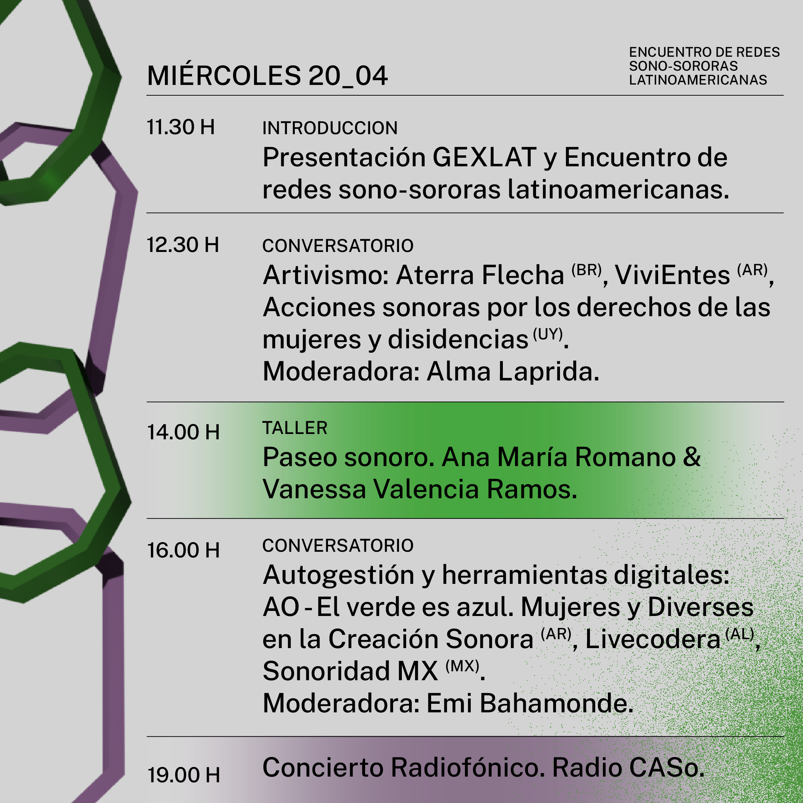
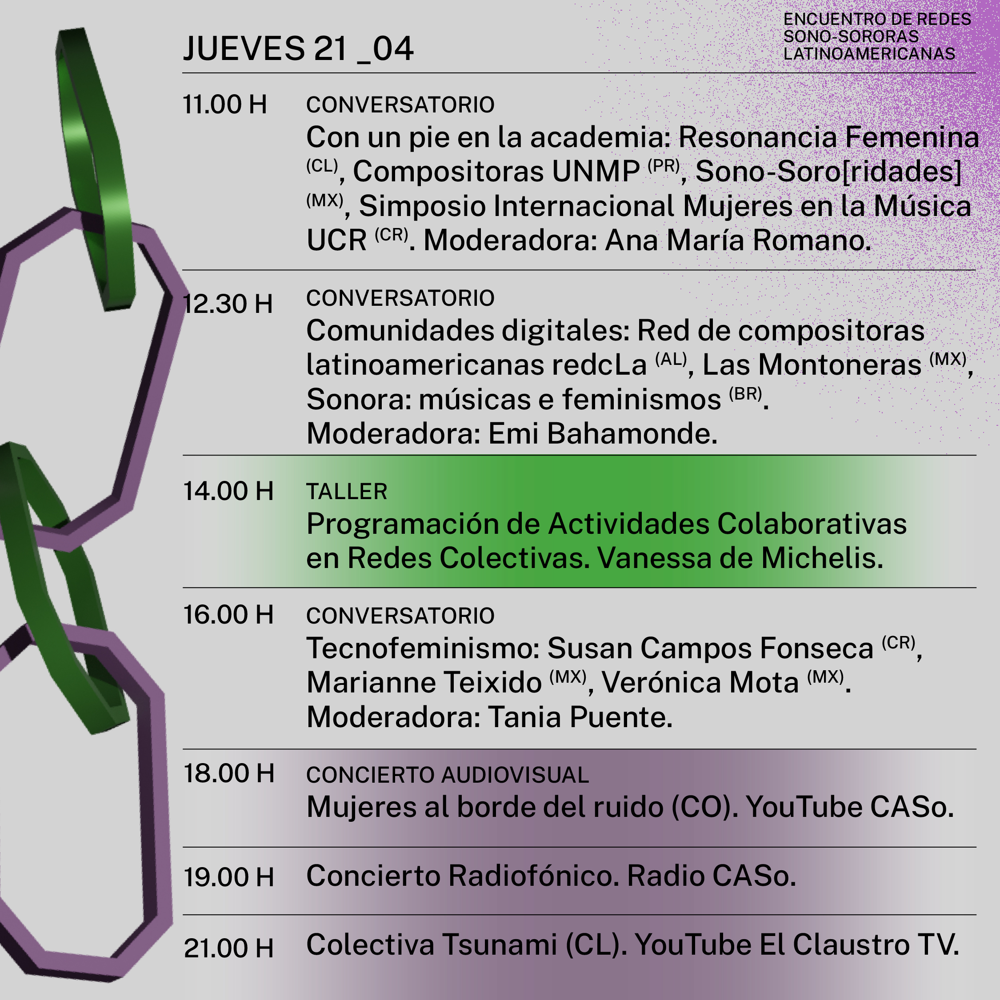
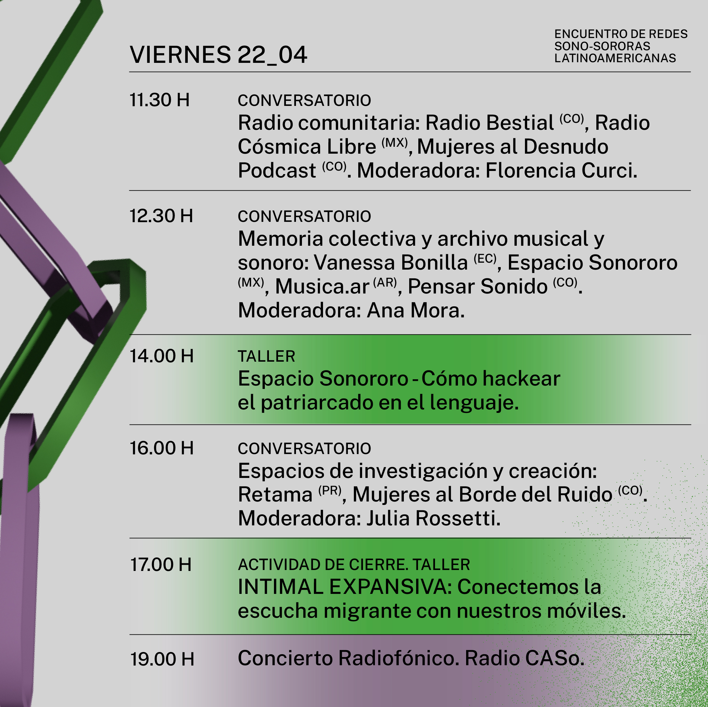
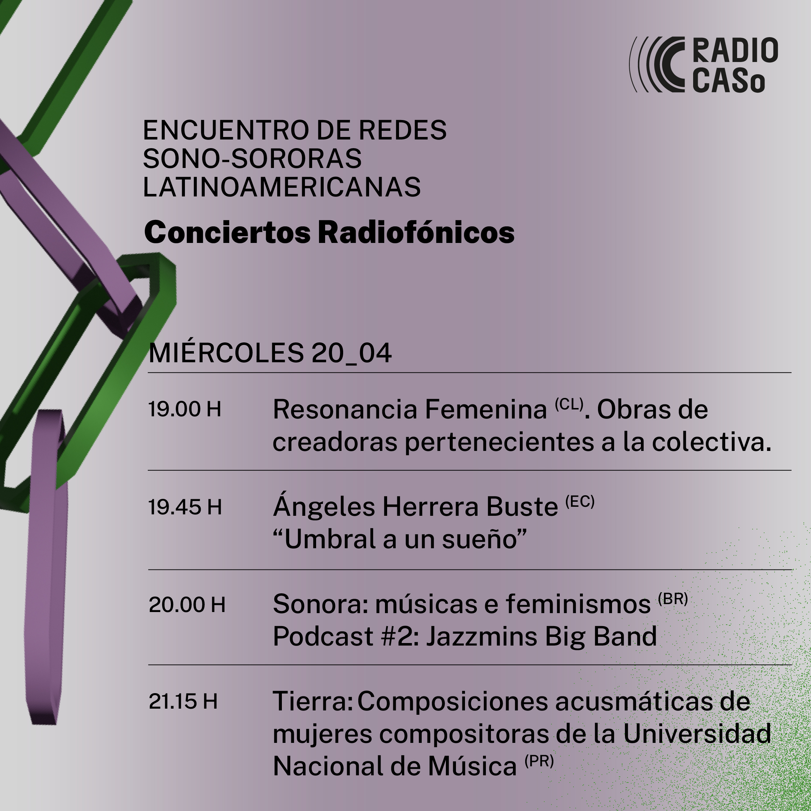
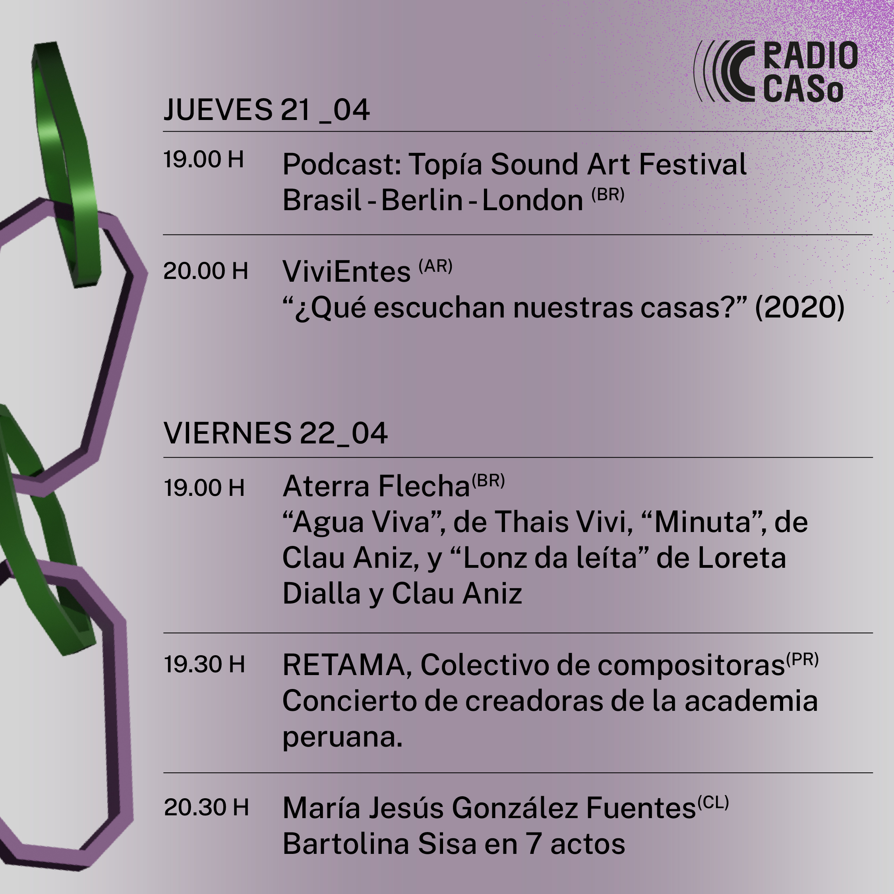

[Inicio](./)

# Encuentro de redes sono-sororas latinoamericanas
## Tecnofeminismos desde el Sur

Encuentro virtual internacional que se realizará el 20, 21 y 22 de abril de 2022 con participación de colectivas, redes, plataformas y otras acciones feministas de Latinoamérica relacionadas con el trabajo con tecnologías en los campos del arte sonoro, la música experimental e improvisada y la música contemporánea. 

Organizado por un equipo ad hoc de artistas y activistas feministas de Brasil, Colombia, Ecuador, México y Argentina; el encuentro está pensado para que las colectivas participantes se conozcan entre sí, compartan modos de hacer y problemáticas específicas y que se generen vínculos entre ellas con el fin de tejer nuevas redes y realizar colaboraciones. 

### Ver programación en línea: [YouTube: CASo - Centro de Arte Sonoro](https://www.youtube.com/channel/UCIFc-X-Xz4RsNEzuA4P-EMA)  

Más informacion: [https://centrodeartesonoro.cultura.gob.ar](https://centrodeartesonoro.cultura.gob.ar)  

__↓↓↓Info e enscripciones a talleres después de programación↓↓↓__ 

### Programación - Talleres y Charlas

### Programación - Conciertos Radiofónicos

### TALLERES 

#### Paseo sonoro
*Miércoles 20 de abril - 14 hs (Argentina)*  
Coordinadoras: Ana María Romano y Vanessa Valencia Ramos  
Duración 2 hs  
Destinatarixs: participantes del Encuentro. Cupo máximo 15 personas  
[Descripción completa y formulario](https://forms.gle/pxGJSYWK1kPwe3yc6)  

#### Programación de actividades colaborativas en redes colectivas
*Jueves 21 de abril - 14 hs (Argentina)*  
Coordinadora: Vanessa de Michelis  
Duración 1 hs  
Destinatarixs: participantes de colectivas y redes que participen en el Encuentro y/o personas que estén dispuestas a trabajar en grupo en el taller  
[Descripción completa y formulario](https://forms.gle/Qh3ta4R5Uxcs3xw87)  

#### Cómo hackear el patriarcado en el lenguaje
*Viernes 22 de abril - 14 hs (Argentina)*  
Coordinadoras: Espacio Sonororo  
Duración 2 hs  
Destinatarixs: Cualquier persona… porque todas usamos el lenguaje todo el tiempo. Aforo máximo 60 personas  
[Descripción completa y formulario](https://forms.gle/7VSt5KfSjb7hdcFs8)  

#### INTIMAL EXPANSIVA: Conectemos la escucha migrante con nuestros móviles
*Viernes 22 de abril - 17 hs (Argentina)*  
Coordinadoras: Ximena Alarcón, Myriam Ojeda, Silvia Villalba de Colectivo INTIMAL  
Duración 1:30 hs  
Destinatarixs: 12 mujeres representantes de colectivas o redes feministas de Latinoamérica   
[Descripción completa y formulario](https://forms.gle/pQpfWMSNvjTTsai87) 

_________________

## Organizadoras

<iframe src="https://www.facebook.com/plugins/video.php?height=476&href=https%3A%2F%2Fwww.facebook.com%2FCASoCNB%2Fvideos%2F517075916639320%2F&show_text=false&width=476&t=0" width="476" height="476" style="border:none;overflow:hidden" scrolling="no" frameborder="0" allowfullscreen="true" allow="autoplay; clipboard-write; encrypted-media; picture-in-picture; web-share" allowFullScreen="true"></iframe>  

### GEXLAT (Género Experimentación Latinoamérica)
Es un grupo de trabajo que funciona desde el año 2020. Está integrado por artistas de distintas disciplinas y que forman parte de plataformas y colectivas feministas latinoamericanas. Crearon un sitio web con una base de datos que incluye mujeres, lesbianas, trans, intersex, personas de género fluido y otras disidencias que experimentan con sonido en Latinoamérica.  

### MUSEXPLAT 

Es una plataforma que inició sus actividades en 2018, cuyo principal objetivo es conectar creadores, gestores y comunicadores de Música Experimental en Latinoamérica. Hacer Música Experimental no solo significa buscar nuevas sonoridades y técnicas de producción musical innovadoras; Música Experimental también implica dar espacio a todas aquellas propuestas que han sido invisibilizadas por diversas razones en el pasado. Musexplat busca una escena solidaria, para que todas las personas involucradas sean agentes de cambio.  

[https://musexplat.com](https://musexplat.com) 

### Plataforma Feminista En Tiempo Real

La Plataforma Feminista En Tiempo Real, con sede en Bogotá, Colombia, se concibe como un espacio que le da la bienvenida a propuestas en donde el sonido se imagina desde múltiples naturalezas y se construye en amplias perspectivas, por ello se abre a propuestas cuyas indagaciones se manifiestan en la diversidad surgida de los diálogos entre sonido y tecnología desde perspectivas experimentales y feministas.  

La Plataforma Feminista En Tiempo Real está conformada por el Festival En Tiempo Real, la Escuela de Experimentación Sonora y la editorial, en todas ellas trabajamos de manera articulada con colectivas y organizaciones porque nuestra acción política es el trabajo colaborativo como apuesta para aportar al bienestar y a mejores futuros.  

[https://tiemporealyladob.wordpress.com](https://tiemporealyladob.wordpress.com) 

### Sonora – musicas e feminismos

Es una red colaborativa que reúne artistas e investigadorxs interesadxs en manifestaciones feministas en el contexto de las artes. Surgió en abril de 2015 a partir de la necesidad de visibilizar y posibilitar el diálogo acerca del trabajo artístico de las mujeres. Tiene apoyo del NuSom – Núcleo de Investigaciones en Sonología de la USP. Sonora propone la creación y ocupación de espacios, la realización de investigaciones y debates, y está involucrada en actividades musicales y sonoras de distintas vertientes. Sonora es atravesada por incertidumbres, indefiniciones, reticencias, aperturas, afectividades, sensibilidades, ruidos.  

[http://www.sonora.me](http://www.sonora.me) 

[Inicio](./)
